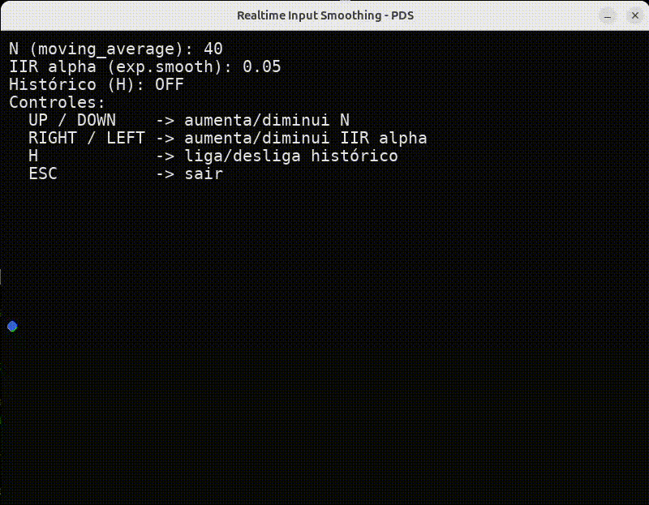

# Input Smoothing PDS

Visualizador em tempo real de suavização de entrada (mouse) usando média móvel e suavização exponencial (IIR). Permite ajustar parâmetros no teclado e ligar/desligar o histórico para observar o efeito dos filtros.

## Pré-requisitos
- Python 3.10+ instalado.
- Dependências: pygame, numpy, matplotlib (instale via `pip` com o `requirements.txt`).

## Instalação e execução
1. (Opcional) Crie e ative um ambiente virtual:
   ```bash
   python3 -m venv .venv
   source .venv/bin/activate
   ```
2. Instale as dependências:
   ```bash
   pip install -r requirements.txt
   ```
3. Rode o app:
   ```bash
   python3 src/main.py
   ```

## Controles

### Controles Básicos
- `UP` / `DOWN`: aumenta/diminui o tamanho da janela da média móvel (N).
- `RIGHT` / `LEFT`: aumenta/diminui o fator `alpha` do filtro exponencial.
- `H`: liga/desliga o histórico; ao desligar, o histórico e o estado do filtro são limpos.
- `ESC` ou fechar a janela: sair.

### Novos Controles de Visualização
- `1`, `2`, `3`: toggle de visibilidade das linhas (Raw, Moving Average, Exponential Smoothing).
- `Scroll do Mouse`: zoom in/out.
- `Botão do Meio do Mouse` (arrastar): pan (mover a visualização).
- `R`: reset zoom e pan.
- `F11`: alterna modo tela cheia.

### Análise e Exportação
- `G`: gera gráficos 3D dos resultados (salvos na pasta `output/`).
  - Cria dois arquivos: plot 3D do caminho e mapa de densidade 3D.

## O que você vê na tela
- **Linha vermelha**: pontos brutos do mouse.
- **Linha verde**: média móvel dos pontos.
- **Linha azul**: suavização exponencial (IIR).
- **Círculos**: indicam a posição atual de cada série.
- **HUD**: mostra os parâmetros ativos, controles e estado de visibilidade.
- **Gráfico de Métricas** (canto superior direito): mostra FPS e latência em tempo real.
- **Indicador Visual**: aparece quando parâmetros são alterados.

### Gráficos 3D
Ao pressionar `G`, são gerados dois gráficos 3D salvos na pasta `output/`:
1. **Plot 3D do Caminho**: mostra o caminho do mouse ao longo do tempo (eixo Z = tempo).
2. **Mapa de Densidade 3D**: mostra mapas de calor 3D da densidade de cada tipo de filtro.

## Arquitetura rápida
- `src/main.py`: laço principal, inicialização e orquestração.
- `src/ui.py`: entrada de usuário (teclas, mouse), renderização e gerenciamento de estado visual.
- `src/ui_state.py`: classes para gerenciar estado da UI (zoom, pan, visibilidade, métricas).
- `src/input_device.py`: estruturas de dados e filtros (média móvel e IIR) com buffers.
- `src/filters.py`: funções puras de filtragem.
- `src/plot_3d.py`: geração de visualizações 3D usando matplotlib.
